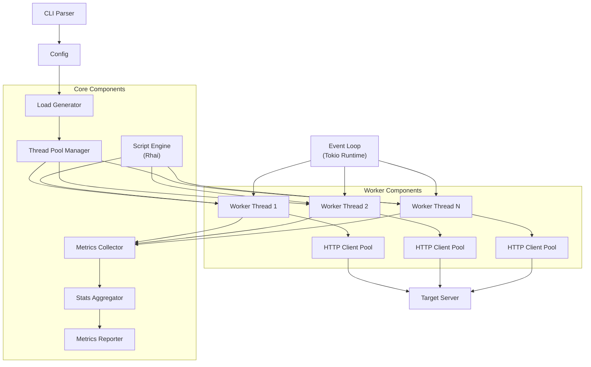
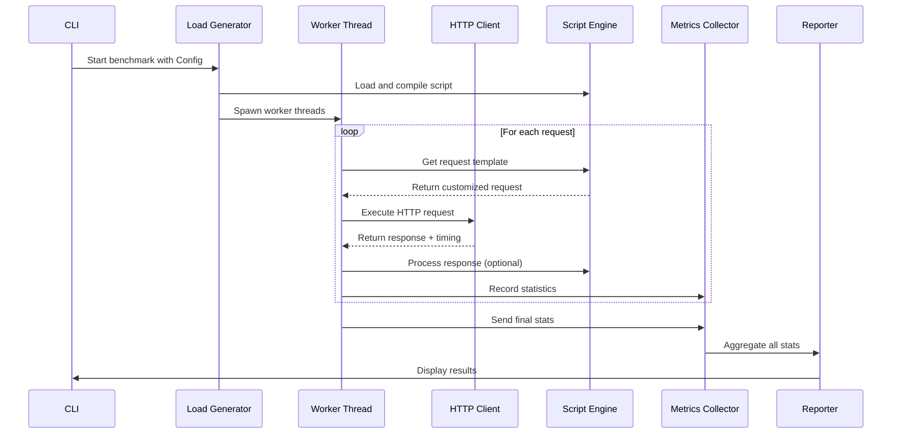

# Architecture

```mermaid
graph TD
    A["CLI Parser"] --> B["Config"]
    B --> C["Load Generator"]
    C --> D["Thread Pool Manager"]
    D --> E1["Worker Thread 1"]
    D --> E2["Worker Thread 2"]
    D --> E3["Worker Thread N"]
    
    E1 --> F1["HTTP Client Pool"]
    E2 --> F2["HTTP Client Pool"]
    E3 --> F3["HTTP Client Pool"]
    
    F1 --> G["Target Server"]
    F2 --> G
    F3 --> G
    
    E1 --> H["Metrics Collector"]
    E2 --> H
    E3 --> H
    
    H --> I["Stats Aggregator"]
    I --> J["Metrics Reporter"]
    
    K["Script Engine<br/>(Rhai)"] --> E1
    K --> E2
    K --> E3
    
    L["Event Loop<br/>(Tokio Runtime)"] --> E1
    L --> E2
    L --> E3
    
    subgraph "Core Components"
        C
        D
        H
        I
        J
        K
    end
    
    subgraph "Worker Components"
        E1
        E2
        E3
        F1
        F2
        F3
    end
```

```mermaid
sequenceDiagram
    participant CLI
    participant LoadGen as Load Generator
    participant Worker as Worker Thread
    participant Client as HTTP Client
    participant Script as Script Engine
    participant Metrics as Metrics Collector
    participant Reporter
    
    CLI->>LoadGen: Start benchmark with Config
    LoadGen->>Script: Load and compile script
    LoadGen->>Worker: Spawn worker threads
    
    loop For each request
        Worker->>Script: Get request template
        Script-->>Worker: Return customized request
        Worker->>Client: Execute HTTP request
        Client-->>Worker: Return response + timing
        Worker->>Script: Process response (optional)
        Worker->>Metrics: Record statistics
    end
    
    Worker->>Metrics: Send final stats
    Metrics->>Reporter: Aggregate all stats
    Reporter->>CLI: Display results
```
